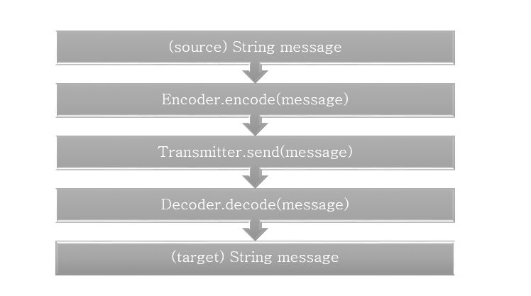

# bitEncoderDecoderCollaboration 
Shared project by: Paweł Dąbrowski, Przemysław Tyczyno and Rafał Pajdak

Multistage coding exercise based on JetBrains Academy project https://hyperskill.org/projects/58?track=1

## What we are learning here
<ul>
<li>working in small group on one project</li>
<li>simple documentation</li>
<li>branching and issue tracking</li>
</ul>

## What is this project actually?
We are building an App which simulates transmission of information via internet.  
There are three modules here:
<ol>
<li><strong>Encoder</strong> - encodes input using a specific strategy to prevent information loss on transfer.</li>
<li><strong>Transmitter</strong> - simulates transmission errors occurring while sending a message, i.e. generates random noise in each section of input.</li>
<li><strong>Decoder</strong> - reads message with errors and recovers the original input, using loss-prevention strategies implemented while encoding message.</li></ol>

On Stages 1-4 we are working with loss prevention strategies based on symbol (char) level. Stages 5+ will be dedicated for bitwise operations, such as bit parity or/and Hamming code.

 

## Workflow
<ol>
<li>Project is divided into small <strong>Stages</strong>, each contributing to the final project. Stages are independent, but we are releasing them in ascending order.</li>
<li>Each Stage consist of smaller steps to accomplish - at least: tests (we try to follow TDD), documentation and implementation.</li>
<li>Issues are created on Project page in column <strong>To do</strong> and assigned to a developer. Every contribution should have an issue created.</li>
<li>When we start working on issue, we change its status from <strong>To do</strong> to <strong>In progress</strong>.</li>
<li>When the code is done, we change status to <strong>In review</strong> and wait for acceptance of other members.</li>
<li>If code is accepted, merge is done by contributor. Change issue status to <strong>Done</strong></li>
<li>if code is not accepted, add comments and change status to <strong>In progress</strong></li>
</ol>

## Branching instruction
<ul><li>Each branch is named for issue number and short label, describing feature. If there is no issue connected to your task - create one.</li>
<li>We are pulling our code to <strong>dev</strong> branch for <strong>current Stage</strong> PRs.</li>
<li>While working on features for future Stages (not considered in nearest release), we are pulling to <strong>dev-StageX</strong> branches respectively.</li>
<li>After completing new stage, there is a release pull from <strong>dev</strong> to <strong>main</strong>. It is done during team meeting after discussion.</li></ul>

Example name of branch:

> 40-newBranchesDescription
> 

## Stage 1
Introduction - create a method encode() in class Stage1. Method takes a string as an input and return another string with tripled each character.

> For example:
>
> abc -> aaabbbccc
>
> test -> ttteeesssttt

## Stage 2
Create a method send() in class Stage2. Method takes a string (it should be each character repeat 3 times, for example 
instead of d - ddd) as an input and return another string, with changed one char of each of 3 chars blocks.
>For example
>
>aaabbbccc -> axabtbcoc
>
>sssooosss -> ssqsoooss

## Stage 3
Create a method decode() in class Stage3. Method takes a string (as output from Stage2.send()) and tries to recover original message. Strategy is to check each section of 3 chars, because only one char per 3 is corrupted.
>For example:
>
>aaP -> a
>
>TToE_E!SSttO -> TESt

## Stage 4
Connect actions from Stages 1-3 to App class. Use interfaces as described below:
> Encoder: String encode(String)
>
> Transmitter: String send(String)
>
> Decoder: String decode(String)

Interface implementantations come from Stages1-3.